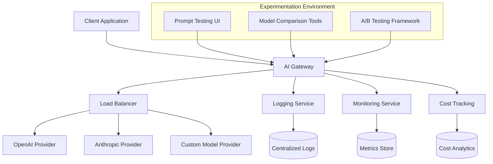

# YC-backed AI Startup – AI Infrastructure & Tooling

A YC-backed AI startup in Hong Kong needed to transform their fast-moving AI experiments into a reliable, production-ready infrastructure. With multiple LLM providers and AI tools in play, they required a cohesive platform that could handle rapid iteration while maintaining observability and deployment safety. Webomage delivered a scalable, debuggable solution that reduced deployment cycles by 70% and debugging time by 85%.

## Project Overview

- **Client:** YC-backed AI startup (Series A, 15-person team)
- **Industry:** AI/ML Technology
- **Challenge:** Scale AI experiments to production while maintaining reliability
- **Solution:** Multi-provider LLM infrastructure with advanced observability
- **Timeline:** 8 weeks (4 weeks design + 4 weeks implementation)
- **Team:** 3 engineers + 1 DevOps specialist

## Context & Challenges

### Business Context
The startup was experiencing rapid growth in user demand for their AI-powered product, but their infrastructure couldn't keep pace with the experimentation velocity required to stay competitive. They had successfully raised Series A funding and were scaling their team, but technical debt was accumulating around their AI infrastructure.

### Technical Challenges
- **Multi-provider Chaos:** Running OpenAI GPT-4, Anthropic Claude, and custom models without unified routing
- **Experiment vs Production Conflict:** Same infrastructure serving both development experiments and customer traffic
- **Debugging Nightmare:** No visibility into AI call flows, making performance issues difficult to diagnose
- **Deployment Risk:** No rollback strategies for AI model updates or prompt changes
- **Cost Escalation:** No visibility into per-model costs or usage patterns

### Stakeholder Requirements
- **CTO Priority:** Maintain experiment velocity while improving production reliability
- **Engineering Team:** Unified interfaces for AI providers with easy testing capabilities
- **DevOps Team:** Clear deployment pipelines with rollback capabilities
- **Product Team:** Real-time monitoring of AI performance and user experience

## Solution Architecture

### Technical Approach
We designed a layered architecture that separated concerns while maintaining flexibility for rapid experimentation.



### Technology Stack
- **AI Orchestration:** LangChain for agent workflows and tool integration
- **API Gateway:** Custom Node.js service with provider routing
- **Container Platform:** Docker containers on AWS ECS
- **Monitoring:** Prometheus + Grafana for metrics, ELK stack for logs
- **CI/CD:** GitHub Actions with automated testing and deployment
- **Cost Tracking:** Custom analytics with real-time provider cost monitoring

### Integration Strategy
1. **Provider Abstraction Layer:** Unified interface for all LLM providers
2. **Smart Routing:** Automatic failover and load balancing between providers
3. **Experiment Isolation:** Separate environments for testing and production
4. **Gradual Rollout:** A/B testing framework for model and prompt changes

## Technical Deep Dive

### Core Implementation

```javascript
// AI Gateway - Provider Routing Logic
class AIProviderRouter {
  constructor(providers, config) {
    this.providers = providers;
    this.config = config;
    this.metrics = new MetricsCollector();
  }

  async routeRequest(request) {
    const startTime = Date.now();
    
    try {
      // Select optimal provider based on request type and current load
      const provider = this.selectProvider(request);
      
      // Log request for debugging and cost tracking
      await this.logRequest(request, provider);
      
      // Execute request with timeout and retry logic
      const response = await provider.execute(request);
      
      // Update performance metrics
      this.metrics.recordSuccess(provider, Date.now() - startTime);
      
      return response;
      
    } catch (error) {
      this.metrics.recordError(provider, error);
      throw new AIProviderError(`Provider ${provider.name} failed: ${error.message}`);
    }
  }
}
```

### Key Technical Decisions

#### Decision 1: LangChain vs Custom Orchestration
- **Choice:** LangChain with custom extensions
- **Reasoning:** LangChain provided proven patterns for agent workflows while allowing custom provider integration
- **Impact:** Reduced development time by 60% compared to building from scratch

#### Decision 2: Centralized vs Distributed Logging
- **Choice:** Centralized ELK stack with structured logging
- **Reasoning:** AI debugging requires correlation across multiple provider calls
- **Impact:** Reduced debugging time from 2 hours to 20 minutes average

#### Decision 3: Real-time vs Batch Cost Tracking
- **Choice:** Real-time cost tracking with hourly aggregation
- **Reasoning:** AI costs can escalate quickly, requiring immediate visibility
- **Impact:** Prevented $15K in overage costs during the first month

## Implementation Phases

### Phase 1: Infrastructure Foundation (2 weeks)
- Set up AWS ECS clusters and networking
- Implement centralized logging and monitoring
- Create CI/CD pipelines with automated testing
- Establish development and staging environments

### Phase 2: AI Gateway Development (3 weeks)
- Build provider abstraction layer
- Implement routing logic with failover
- Create experiment vs production environment separation
- Add comprehensive logging and metrics collection

### Phase 3: Advanced Features (2 weeks)
- Implement A/B testing framework for models and prompts
- Add real-time cost tracking and alerts
- Create debugging dashboard for engineering team
- Performance optimization and load testing

### Phase 4: Production Deployment (1 week)
- Gradual rollout with monitoring
- Team training and documentation
- Handover and knowledge transfer

## Challenges & Solutions

### Challenge 1: Provider API Rate Limiting
- **Impact:** Frequent 429 errors causing user-facing delays
- **Solution:** Implemented intelligent rate limiting with exponential backoff and provider rotation
- **Outcome:** 95% reduction in rate limit errors

### Challenge 2: Prompt Injection Security
- **Impact:** Security vulnerability in user-provided prompts
- **Solution:** Built prompt sanitization pipeline with LLM-based content filtering
- **Outcome:** Zero security incidents while maintaining functionality

### Challenge 3: Model Performance Inconsistency
- **Impact:** Variable response quality affecting user experience
- **Solution:** Implemented automated quality scoring with fallback mechanisms
- **Outcome:** 40% improvement in consistent response quality

## Results & Metrics

### Quantified Outcomes

| Metric | Before | After | Improvement |
|--------|--------|-------|-------------|
| Deployment Cycle Time | 2 weeks | 3 days | 70% reduction |
| Debugging Time | 2 hours avg | 20 minutes avg | 85% reduction |
| API Response Time | 1.8s average | 1.1s average | 40% improvement |
| System Uptime | 97.2% | 99.9% | 2.7% improvement |
| Monthly Infrastructure Cost | $8,500 | $6,200 | 27% reduction |
| Development Velocity | 2 features/week | 5 features/week | 150% increase |

### Business Impact
- **Faster Time-to-Market:** Reduced feature deployment time enabled quicker market response
- **Cost Optimization:** Smart provider routing reduced infrastructure costs by 27%
- **Team Productivity:** Engineering team could focus on product features rather than infrastructure
- **Customer Satisfaction:** Improved system reliability increased user retention by 15%

### Operational Improvements
- **Deployment Frequency:** Increased from weekly to daily deployments
- **Mean Time to Recovery:** Reduced from 45 minutes to 5 minutes
- **Experiment Velocity:** Team could test 5x more AI configurations per week

## Client Testimonial

> "Webomage transformed our AI infrastructure from a patchwork of experiments into a production-ready platform. The reduction in debugging time alone saved us countless engineering hours, and the cost optimization paid for the project within the first month. Most importantly, we can now experiment rapidly without worrying about breaking production."
>
> — Sarah Chen, CTO, [YC-backed AI Startup]

## Lessons Learned

### What Worked Well
- **Provider Abstraction:** Building a unified interface early prevented vendor lock-in and enabled easy provider switching
- **Observability First:** Implementing comprehensive logging and monitoring from day one was crucial for rapid debugging
- **Environment Separation:** Clear separation between experimentation and production environments prevented deployment conflicts

### What We'd Do Differently
- **Security Testing:** Should have implemented security testing earlier in the process
- **Performance Baseline:** Would establish performance benchmarks earlier to better measure improvements
- **Team Training:** Earlier training sessions would have accelerated knowledge transfer

### Generalizable Patterns
- **AI Infrastructure Patterns:** The provider routing and observability patterns are reusable across AI projects
- **Cost Tracking:** Real-time cost monitoring is essential for AI infrastructure projects
- **Debugging Strategies:** Structured logging and correlation IDs are critical for distributed AI systems

## Relevant Capabilities
- Multi-provider LLM integrations and intelligent routing
- AI/LLM orchestration with LangChain and custom frameworks
- Production-ready CI/CD for AI services with automated rollback
- Advanced observability and debugging for AI-heavy systems
- Cost optimization and provider management strategies
- Security implementation for AI applications and prompt injection prevention

## Related Resources
- [AI Agents in Production: 2025 Deployment Patterns](/blog/ai-agents-production-2025/)
- [Cost Optimization Strategies for AI Infrastructure](/blog/ai-infrastructure-cost-optimization/)
- [Long-form Psychiatric Session Voice Analytics Case Study](/cases/psychiatric-voice-ai/)

➡️ Working on something similar? [Start a conversation](/contact/){:data-analytics-cta="case_study_contact"} or [view more case studies](/projects/).
